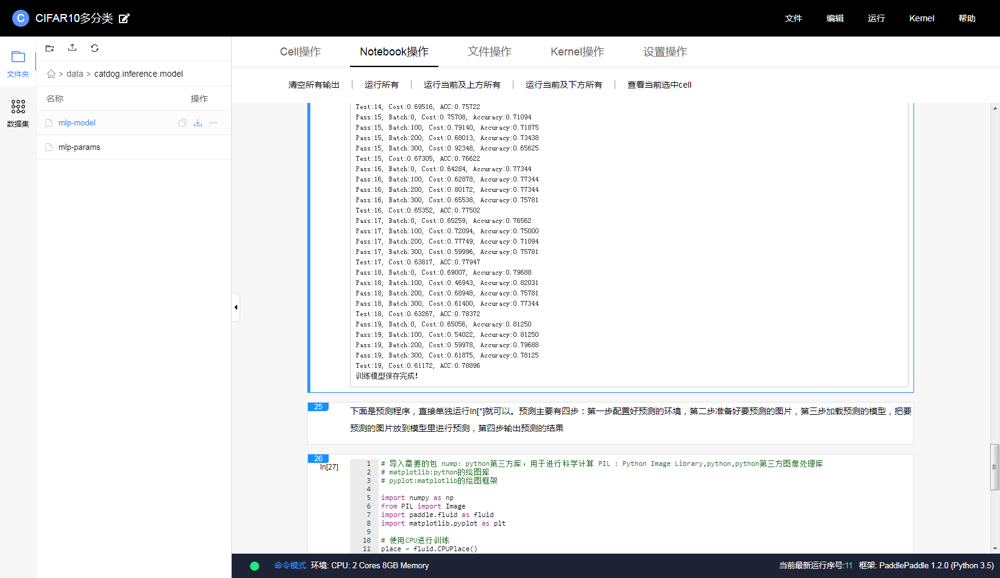

# Edgeboard试用————基于CIFAR10分类模型的移植

## 前言
在上一周的测试中，我们按照官方给的流程，使用EasyDl快速实现了一个具有性别检测功能的人脸识别系统，那么今天，我们将要试一下通过Paddlepaddle从零开始，训练一个自己的多分类模型，并进行嵌入式部署。
整个训练过程和模型在：https://aistudio.baidu.com/aistudio/projectDetail/61103
下面详细介绍模型训练的过程.

## 数据集准备
我们使用CIFAR10数据集。CIFAR10数据集包含60,000张32x32的彩色图片，10个类别，每个类包含6,000张。其中50,000张图片作为训练集，10000张作为验证集。

```
!mkdir -p  /home/aistudio/.cache/paddle/dataset/cifar
# wget将下载的文件存放到指定的文件夹下，同时重命名下载的文件，利用-O
!wget "http://ai-atest.bj.bcebos.com/cifar-10-python.tar.gz" -O cifar-10-python.tar.gz
!mv cifar-10-python.tar.gz  /home/aistudio/.cache/paddle/dataset/cifar/
```


## 模型结构

我们选择了以三个卷积层串联一个全连接层的输出，作为猫狗分类的预测，采用固定维度输入，输出为分类数

```
def convolutional_neural_network(img): 
    # 第一个卷积-池化层 
    conv_pool_1 = fluid.nets.simple_img_conv_pool( 
        input=img,         # 输入图像 
        filter_size=5,     # 滤波器的大小 
        num_filters=20,    # filter 的数量。它与输出的通道相同 
        pool_size=2,       # 池化层大小2*2 
        pool_stride=2,     # 池化层步长 
        act="relu")        # 激活类型 
    # 第二个卷积-池化层 
    conv_pool_2 = fluid.nets.simple_img_conv_pool( 
        input=conv_pool_1, 
        filter_size=5, 
        num_filters=50, 
        pool_size=2, 
        pool_stride=2, 
        act="relu") 
    # 第三个卷积-池化层 
    conv_pool_3 = fluid.nets.simple_img_conv_pool( 
        input=conv_pool_2, 
        filter_size=5, 
        num_filters=50, 
        pool_size=2, 
        pool_stride=2, 
        act="relu") 
    # 以softmax为激活函数的全连接输出层，10类数据输出10个数字 
    prediction = fluid.layers.fc(input=conv_pool_3, size=10, act='softmax') 
    return prediction 
```


## 训练&验证

接下来在Paddlepaddle fluid上，进行训练。整个训练代码见附件train.py
模型验证,采用附件predict.py的代码进行验证与运行时间的测量，选取一张狗的图：dog.jpg (可以fork首页链接aistudio平台上的demo)
连续预测10000次，输出如下:

```
CPU 运行结果为：预处理时间为0.0006270000000085929，预测时间为：16.246494
Out:
im_shape的维度： (1, 3, 32, 32)
The run time of image process is
0.0006270000000085929
The run time of predict is
16.246494
results [array([[5.0159363e-04, 3.5942634e-05, 2.5955746e-02, 4.7745958e-02,
        9.9251214e-03, 9.0146154e-01, 1.9564393e-03, 1.2230080e-02,
        4.7619540e-08, 1.8753216e-04]], dtype=float32)]
infer results: dog
```

```
GPU V100 运行结果为：预处理时间为0.0006390000000067175，预测时间为：15.903074000000018
Out:
im_shape的维度： (1, 3, 32, 32)
The run time of image process is
0.0006390000000067175
The run time of predict is
15.903074000000018
results [array([[5.0159392e-04, 3.5942641e-05, 2.5955772e-02, 4.7746032e-02,
        9.9251205e-03, 9.0146142e-01, 1.9564414e-03, 1.2230078e-02,
        4.7619821e-08, 1.8753250e-04]], dtype=float32)]
infer results: dog
```

可以看到,模型可以正确的识别出图片中的动物为狗，接下来，我们就要尝试将这个模型部署到Edgeboard上面。


## 模型导出

我们需要将模型保存为模型文件model以及权重文件params,可以采用如下Paddle的API进行保存

```
fluid.io.save_inference_model(model_save_dir,['images'],[predict], exe,params_filename="mlp" + '-params',model_filename="mlp" + '-model',)
```

如图所示，在AiStudio的左侧打开模型文件所在的文件夹，下载mlp-model、mlp-params两个文件。




## 在Edgeboard上部署模型，完成预测

1、新建工程文件夹，目录结构如下(可以仿照sample里的resnet、inception例程)：

```
-sample_image_catdog
	-build
	-image
	-include
		-paddlepaddle-mobile
		-...
	-lib
		-libpaddle-mobile.so
	-model
		-mlp
			-model
			-params
	-src
		-fpga_cv.cpp
		-main.cpp
```

2、将AiStudio上导出来的模型放置在model里的mlp文件夹，修改名字为model、params


3、新建 CMakeLists.txt

```
cmake_minimum_required(VERSION 3.5.1)
project(paddle_edgeboard)

set(CMAKE_CXX_STANDARD 14)
set(CMAKE_EXE_LINKER_FLAGS "${CMAKE_EXE_LINKER_FLAGS} -pthread")

add_definitions(-DPADDLE_MOBILE_FPGA_V1)
add_definitions(-DPADDLE_MOBILE_FPGA)

set(PADDLE_LIB_DIR "${PROJECT_SOURCE_DIR}/lib" )
set(EASYDL_INCLUDE_DIR "${PROJECT_SOURCE_DIR}/include" )
set(PADDLE_INCLUDE_DIR "${PROJECT_SOURCE_DIR}/include/paddle-mobile" )

set(APP_NAME "paddle_edgeboard" )

aux_source_directory(${CMAKE_CURRENT_SOURCE_DIR}/src SRC)


find_package(OpenCV QUIET COMPONENTS core videoio highgui imgproc imgcodecs ml video)
include_directories(SYSTEM ${OpenCV_INCLUDE_DIRS})
#list(APPEND Caffe_LINKER_LIBS ${OpenCV_LIBS})
message(STATUS "OpenCV found (${OpenCV_CONFIG_PATH})，${OpenCV_LIBS}")
#add_definitions(-DUSE_OPENCV)

include_directories(${EASYDL_INCLUDE_DIR})
include_directories(${PADDLE_INCLUDE_DIR})
LINK_DIRECTORIES(${PADDLE_LIB_DIR})

add_executable(${APP_NAME} ${SRC})
target_link_libraries(${APP_NAME} paddle-mobile)
target_link_libraries(${APP_NAME} ${OpenCV_LIBS} ) 
```

4、main.cpp

```
#include <iostream>
#include "io/paddle_inference_api.h"
#include "math.h"
#include <stdlib.h>
#include <unistd.h>
#include <fstream>
#include <ostream>
#include <fstream>
#include <iomanip>
#include <typeinfo>
#include <typeindex>
#include <vector>
#include<ctime>
#include "fpga/KD/float16.hpp"
#include "fpga/KD/llapi/zynqmp_api.h"

using namespace paddle_mobile;

#include <opencv2/highgui.hpp>
#include <opencv2/imgproc.hpp>
using namespace cv;

cv::Mat sample_float;

static std::vector<std::string> label_list(10);

void readImage(std::string filename, float* buffer) {
  Mat img = imread(filename);
  if (img.empty()) {
      std::cerr << "Can't read image from the file: " << filename << std::endl;
      exit(-1);
  }
  
  Mat img2;
  resize(img, img2, Size(32,32));

  img2.convertTo(sample_float, CV_32FC3);

  int index = 0;
  for (int row = 0; row < sample_float.rows; ++row) {
    float* ptr = (float*)sample_float.ptr(row);
    for (int col = 0; col < sample_float.cols; col++) {
        float* uc_pixel = ptr;
        // uc_pixel[0] -= 102;
        // uc_pixel[1] -= 117;
        // uc_pixel[1] -= 124;
        float r = uc_pixel[0];
        float g = uc_pixel[1];
        float b = uc_pixel[2];     

        buffer[index] = b / 255.0;
        buffer[index + 1] = g  / 255.0;
        buffer[index + 2] = r  / 255.0;

        // sum += a + b + c;
        ptr += 3;
        // DLOG << "r:" << r << " g:" << g << " b:" << b;
        index += 3;
    }
  }
  // return sample_float;
}


PaddleMobileConfig GetConfig() {
  PaddleMobileConfig config;
  config.precision = PaddleMobileConfig::FP32;
  config.device = PaddleMobileConfig::kFPGA;
  // config.model_dir = "../models/mobilenet/";
  config.prog_file = "../model/mlp/model";
  config.param_file = "../model/mlp/params";
  config.thread_num = 4;
  return config;
}

int main() {
  clock_t startTime,endTime;
  
  zynqmp::open_device();
  std::cout << " open_device success " << std::endl;
  PaddleMobileConfig config = GetConfig();
  std::cout << " GetConfig success " << std::endl;
  auto predictor =
      CreatePaddlePredictor<PaddleMobileConfig,
                            PaddleEngineKind::kPaddleMobile>(config);
  std::cout << " predictor success " << std::endl;

  startTime = clock();//计时开始

  float data[1 * 3 * 32 * 32] = {1.0f};
  readImage("../image/cat.jpg", data);
  
  endTime = clock();//计时结束
  std::cout << "The run time of image process is: " <<(double)(endTime - startTime) / CLOCKS_PER_SEC << "s" << std::endl;
  
  PaddleTensor tensor;
  tensor.shape = std::vector<int>({1, 3, 32, 32});
  tensor.data = PaddleBuf(data, sizeof(data));
  tensor.dtype = PaddleDType::FLOAT32;
  std::vector<PaddleTensor> paddle_tensor_feeds(1, tensor);

  PaddleTensor tensor_out;
  tensor_out.shape = std::vector<int>({});
  tensor_out.data = PaddleBuf();
  tensor_out.dtype = PaddleDType::FLOAT32;
  std::vector<PaddleTensor> outputs(1, tensor_out);

  std::cout << " before predict " << std::endl;

  predictor->Run(paddle_tensor_feeds, &outputs);

  std::cout << " after predict " << std::endl;
  //  assert();

  endTime = clock();//计时结束
  std::cout << "The run time of predict is: " <<(double)(endTime - startTime) / CLOCKS_PER_SEC << "s" << std::endl;


  float* data_o = static_cast<float*>(outputs[0].data.data());
  for (size_t j = 0; j < outputs[0].data.length() / sizeof(float); ++j) {
     std::cout << "output[" << j << "]: " << data_o[j] << std::endl;
  }

  int index = 0;
  float max = 0.0;
  for (int i = 0;i < 10; i++) {
      float val = data_o[i];
      if (val > max) {
          max = val > max ? val : max;
          index = i;
      }
  }

  label_list = {"airplane", "automobile", "bird", "cat", "deer", "dog", "frog", "horse", 
        "ship", "truck" };
  std::cout << "Result" << " is " << label_list[index] << std::endl;

  return 0;
}
```

5、编译运行

```
insmod /home/root/workspace/driver/fpgadrv.ko
cd /home/root/workspace/sample/sample_image_catdog
mkdir build
cd build
rm -rf *
cmake ..
make
./paddle_edgeboard 
```

修改main文件要预测的图像：


6、修改main文件后重复执行预测，可得结果如下：图像处理时间大概为：0.006秒，预测时间大概为：0.008秒


7、连续预测10000次所用时间为：23.7168


## 性能对比（连续预测10000次 单位：秒）

| 平台                                | 前处理耗时    | 模型预测耗时  |
| --------------------------------- | -------- | ------- |
| Edgeboard                         | 0.006    | 23.7168 |
| CPU(AISTUDIO平台双核8G)               | 0.000627 | 16.2464 |
| GPU(AISTUDIO平台双核8G+GPU V100 16GB) | 0.000639 | 15.9030 |
## 总结
**优点：**

1. EdgeBoard内置的Paddle-Mobile，可以与Paddle训练出来的模型进行较好的对接。
2. 预测速度上: Edge在预测小模型的时候，能与双核CPU和GPU在一个数量级，估计是模型较小，batch size也为1，gpu，cpu的性能优势抵不过通信的开销，后续将进行大模型、高batch size的测试。
3. 提供的demo也足够简单，修改起来难度很低。

**不足：**

1. Paddle-Mobile相关文档具有一定门槛，且较为分散。初次使用的时候会走一些弯路出现问题的时候往往是个黑盒，不易于定位。在这次进行模型训练的尝试中，出现过一次op不支持的情况，我们在官网上甚至没有找到支持的op列表，这个在开发哥们的支持下升级版本后解决。如果后续能在稳定的固件版本下使用，并有比较易用的sdk，开发门槛可能会进一步降低。