# 【EdgeBoard体验】开箱与上手

## 简介

市面上基于嵌入式平台的神经网络加速平台有很多，今天给大家带来是百度大脑出品的EdgeBoard。按照官网文档的介绍，EdgeBoard是基于Xilinx Zynq Ultrascale+ MPSoC系列芯片打造的一款深度学习加速套件，也就是比较常见的利用FPGA进行加速的方案。

## 开箱

收到的EdgeBoard，是一个淡黄的纸盒子，将其打开，里面共有四样物品，分别为

* EdgeBoard本体一块，相比官网上的图片，多出了散热器、风扇以及起到保护作用的亚克力板
* 已经刷好固件的SD卡一张
* 12V2A适配器一个，接头为2P间距为3.81的接线端子
* MicroUSB线一条


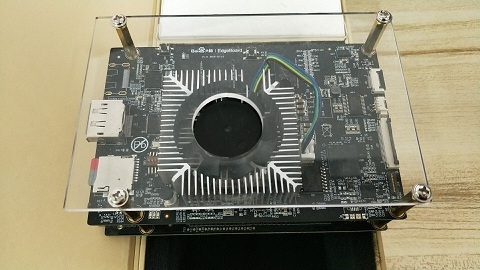

EdgeBoard板子做工不错，按照官网资料，他分为主板和电源板两部分，加上散热器后组合后的长宽高为120&times;80&times;50。板子具体的硬件资源就不过多介绍了，官方目前也没公布具体硬件框图。

## 启动系统

将配套SD卡插入电脑，可以发现他已经烧录好了固件，应该是可以直接启动的（官方资料内没有找到烧录SD卡的方式，如果这张卡丢了的话……）

1. 将SD卡插入SD卡槽，使用MicroUSB线连接电脑，设备管理器里会出现USB to UART的设备。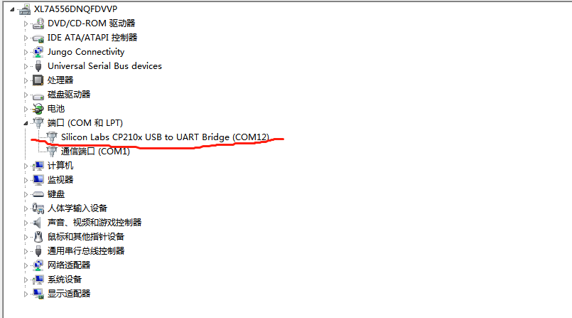

2. 使用任意串口终端打开串口（以Xshell为例），COM口号设置为设备管理所看到的串口号，其余设置如下

   * Band Rate: 115200

   * Data Bits:8

   * Stop Bits:1

   * Parity: None

   * Flow Control: None

      

      
      	

      ​       
3. 将接线端子连接到电源插座，接通电源适配器，可以看到电源灯亮起，风扇传来了怒吼，这个风扇实测转速为6000转，长时间调试时候，噪音略微明显。上电后，可以看到串口终端内显示出了boot数据。

     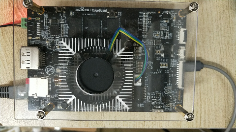
   ```
   Xilinx Zynq MP First Stage Boot Loader 
   Release 2017.4   Apr 23 2019  -  13:19:54
   NOTICE:  ATF running on XCZU9EG/silicon v4/RTL5.1 at 0xfffea000, with PMU firmware
   NOTICE:  BL31: Secure code at 0x0
   NOTICE:  BL31: Non secure code at 0x8000000
   NOTICE:  BL31: v1.3(release):47af34b
   NOTICE:  BL31: Built : 04:10:38, Apr 23 2019
   
   
   U-Boot 2017.01 (Apr 23 2019 - 12:20:25 +0800) Xilinx ZynqMP ZCU102 revB for OpenAi
   
   I2C:   ready
   DRAM:  2 GiB
   EL Level:	EL2
   Chip ID:	xczu9eg
   MMC:   sdhci@ff160000: 0 (eMMC), sdhci@ff170000: 1 (SD)
   reading uboot.env
   ```

   可以看到Xilinx特有的FSBL数据，从中可以看出这个板子的基本配置应该是ZCU102的精简版，配备了2G的DRAM。等待几秒钟后，kernel启动完毕，串口内出现登录信息。

   ```
   PetaLinux 2017.4 edge_board /dev/ttyPS0
   edge_board login: 
   ```

   输入用户名root,密码root，即可进入系统，出现了终端标识，代表启动成功。

   ```
   root@edge_board:~# 
   ```

**总结：**系统启动还是比较容易的，不过在启动过程中遇到一个问题，如果插着网线的话，U-Boot会选择从网络启动，会导致系统启动偏慢

## 配置SSH与SMB开发环境

EdgeBorad已经配置好了SSH终端以及SMB文件共享服务器，也可参照官方使用步骤：https://ai.baidu.com/docs#/EdgeBoard%20quick%20start/23cb95ae

1. 在串口终端查看板子IP

   ```
   root@edge_board:~# ifconfig 
   eth0      Link encap:Ethernet  HWaddr 00:0a:35:00:00:09  
             inet6 addr: fe80::20a:35ff:fe00:9/64 Scope:Link
             UP BROADCAST RUNNING MULTICAST  MTU:1500  Metric:1
             RX packets:39 errors:0 dropped:0 overruns:0 frame:0
             TX packets:122 errors:0 dropped:0 overruns:0 carrier:0
             collisions:0 txqueuelen:1000 
             RX bytes:4964 (4.8 KiB)  TX bytes:25813 (25.2 KiB)
             Interrupt:30 

   eth0:avahi Link encap:Ethernet  HWaddr 00:0a:35:00:00:09  
             inet addr:169.254.1.162  Bcast:169.254.255.255  Mask:255.255.0.0
             UP BROADCAST RUNNING MULTICAST  MTU:1500  Metric:1
             Interrupt:30 

   lo        Link encap:Local Loopback  
             inet addr:127.0.0.1  Mask:255.0.0.0
             inet6 addr: ::1/128 Scope:Host
             UP LOOPBACK RUNNING  MTU:65536  Metric:1
             RX packets:2 errors:0 dropped:0 overruns:0 frame:0
             TX packets:2 errors:0 dropped:0 overruns:0 carrier:0
             collisions:0 txqueuelen:1 
             RX bytes:140 (140.0 B)  TX bytes:140 (140.0 B)
   ```

2. 使用串口读出来的IP,本例中为**169.254.1.162**即可连接上SSH与SMB。本地输入：\\169.254.1.162 即可访问edgeboard文件。Win7系统需要注意一些配置，具体请查看Edgeboard使用说明。
    

**总结：**环境都配置好了，上手还是很简单，在用户目录下发现存在.xfce4的配置文件，莫非带了图形界面？手头没有DP线，后面会试试。

## EasyDL+EdgeBoard搭建带性别检测的人脸识别模型

Edge的卖点之一，就是支持导入EasyDL生成的模型，EasyDL平台是一个使用几十、几百张图片就能训练出一个效果还不错的模型训练平台，官方宣称，对于不了解深度学习的用户，可以仅仅依靠可视化操作即可完成深度学习训练。

1. 登录EasyDl官网创建物体检测模型  http://ai.baidu.com/easydl/。
  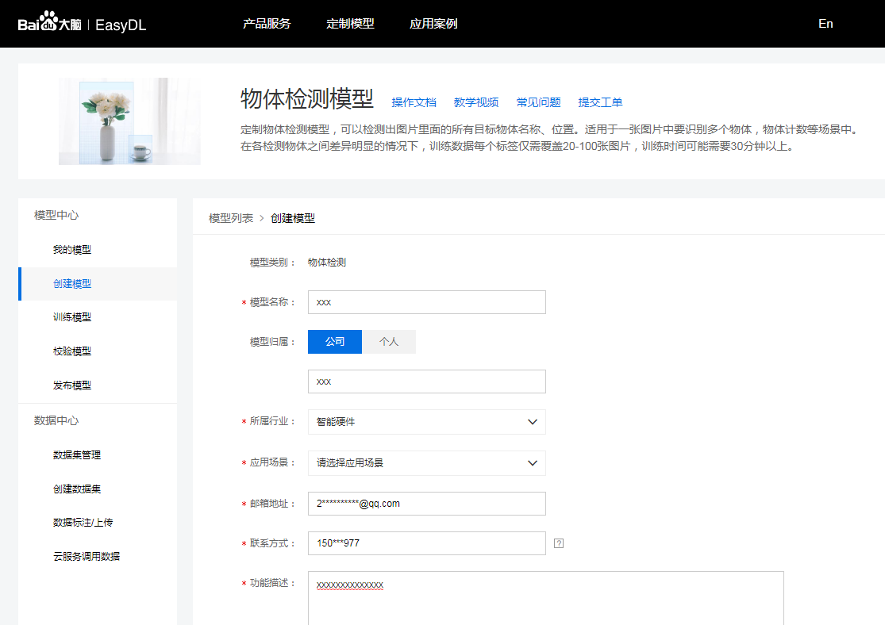

2. 创建训练的数据集，本次测试在百度新闻里抓取了20张包含人脸的图片。
  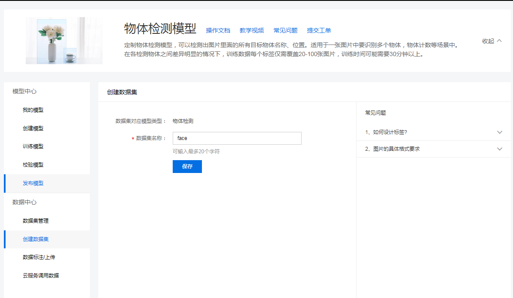

3. 数据集标注，Easydl支持在线标注，只需选中图片用鼠标在图片上拉出一个框即可。
  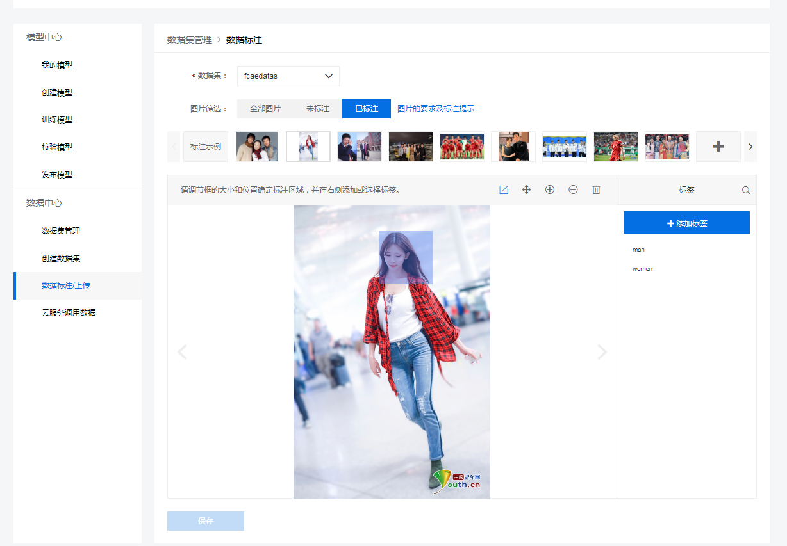

4. 数据集标注完成后即可训练模型，由于要测试的模型是基于SSD的目标检测，所以此次选中精度较低模型。（高精度是基于RetinaNet的模型），点击开始训练，大概需要30分钟左右，即可训练完成。
  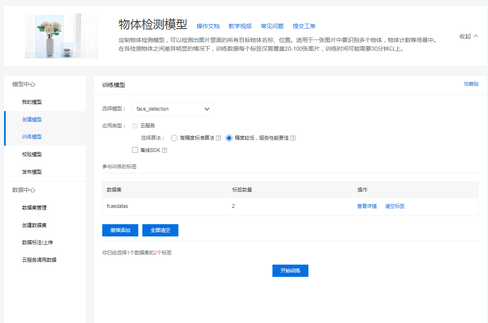

5. 在线校验模型，训练完成后点击校验模型，可以查看测试模型训练效果。此次发现误识别一个女生为男生，猜测大概是训练集太小，不过人脸识别功能到是没问题。
  

6. 模型导出：由于Easydl还没正式发布模型导出功能，因此此次是通过联系后台人员导出的模型。

7. 将Easydl导出的模型，通过SMB传输到EdgeBoard内替换原有的params、model.encrypted：\\169.254.1.162\roothome\workspace\sample\sample_easydl\model
  

8. 重新编译模型，步骤如下：
   ```
    insmod /home/root/workspace/driver/fpgadrv.ko
    cd /home/root/workspace/sample/sample_easyd 
    // 如果没有build目录，创建一个
    mkdir build
    cd build
    rm -rf *
    cmake ..
    make
   ```
    
9. 编程成功之后，运行预测程序。
   ```
    a、在网络上随意下载一张人物图，修改名字为1.jpg 并替换           \\169.254.1.162\roothome\workspace\sample\sample_easydl\image 内的原有图片。
    b.执行./paddle_edgeboard  
   ```
    

10. 查看图片输出结果。
   打开\\169.254.1.162\roothome\workspace\sample\sample_easydl\build\result.jpg
   和命令行预测出的四个目标一致，这里由于没有调整阈值所以检测出来四个框。
   

**总结：**本次是创建了一个简单的Easydl模型并且数据集准备的也小，所以精度不是很高，从可用性和快速部署方面Edgeboard和Easydl的结合可以帮助我们快速开发相关应用产品。

## 运行usb摄像头输入预测示例

1. 连接设备

   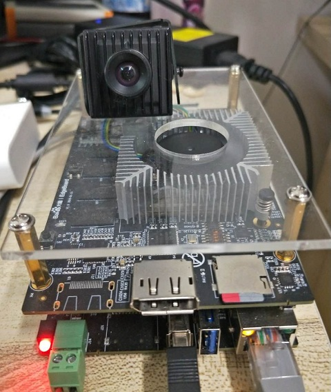

2. 依次执行以下命令
   ```
    // 查看设备文件是否产生，正常是/dev/video2
    ls /dev/video*
    insmod /home/root/workspace/driver/fpgadrv.ko
    cd /home/root/workspace/sample/sample_usb
    mkdir build
    cd build
    rm -rf *
    cmake ..
    make
   ```
3. 执行预测命令
   ```
    ./paddle_edgeboard   
   ```
   输出结果如下：可以看到实时的检测结果
    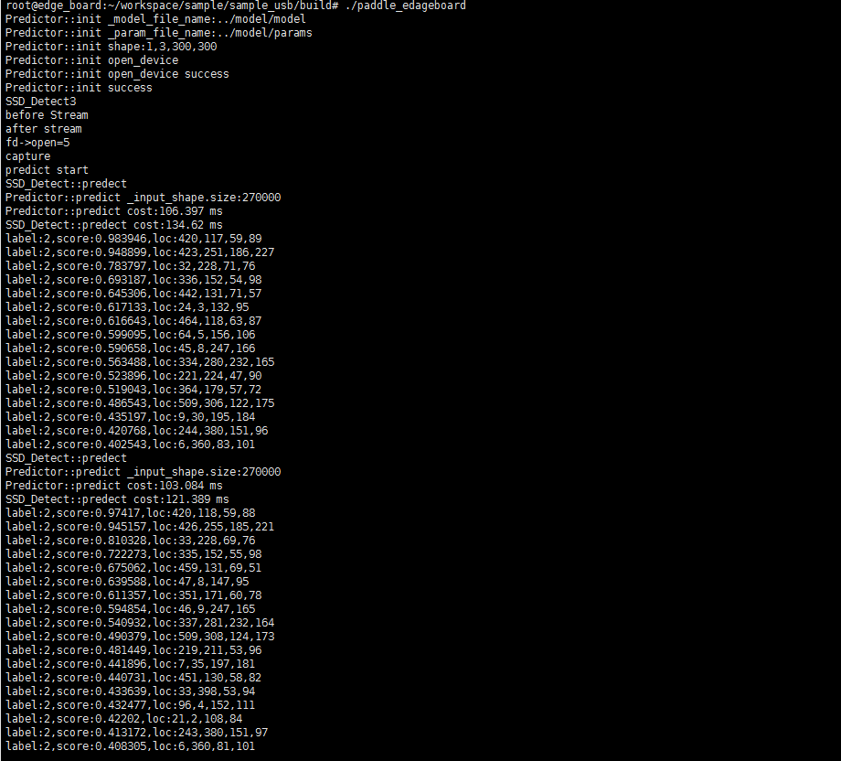

**总结：**本次是通过命令行方式进行的USB摄像头测试，并输出每一帧的目标检测结果，实时性能达到10FPS,效果还不错。

## 运行海思ipc摄像头输入预测示例

1. 连接设备

   

2. 依次执行以下命令

    ```
    insmod /home/root/workspace/driver/fpgadrv.ko
    sudo chmod +x /home/root/workspace/driver/media-ctl
    /home/root/workspace/driver/media-ctl -v -f    '"a0010000.v_tpg":0[fmt:SRGGB8/1920x1080 field:none]'  

    cd /home/root/workspace/sample/sample_bt1120
    mkdir build
    cd build
    rm -rf *
    cmake ..
    make
      
    ```

3. 执行预测命令
   ```
    ./paddle_edgeboard   
   ```
   输出结果如下：可以看到实时的检测结果，例程里无可视化图片生成，下一步先测试一下摄像头采集地效果。
    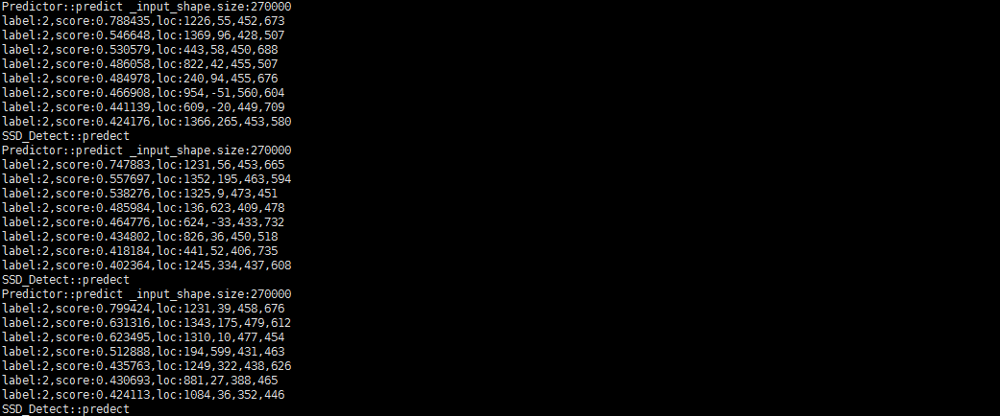

4. 查看摄像头采集图片可视化图

   ```
    ls /dev/video*
    /dev/video0  /dev/video1
    insmod /home/root/workspace/driver/fpgadrv.ko
    sudo chmod +x /home/root/workspace/driver/media-ctl
    /home/root/workspace/driver/media-ctl -v -f    '"a0010000.v_tpg":0[fmt:SRGGB8/1920x1080 field:none]'
    cd /home/root/workspace/tools/bt1120/
    mkdir build
    cd build
    cmake ..
    make
    ./bt1120

   ```
    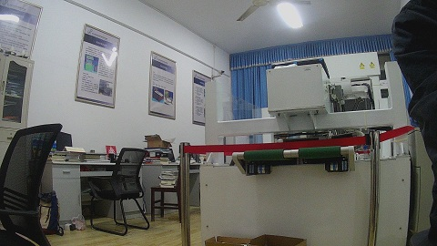

**总结：**海思ipc摄像头使用方法与USB基本一致，还是有个共同的缺点，没有办法进行实时的可视化效果，无法直观观察到模型运行的效果。

## 感受

经过一周的试用，对EdgeBoard也有了初步的了解，总体来说：

**优点**

1. 自带环境丰富，无需配置交叉编译环境即可使用。
2. 默认的smb+ssh环境基本满足了开发需求，实现了到手即用。
3. 与EasyDL结合后，进行目标分类or目标检测的嵌入式集成基本做到了傻瓜化,模型训练容易上手。
4. 从上手来看，EdgeBoard作为一个异构的ARM+FPGA加速平台，基本上做到了无需了解嵌入式与FPGA的程度即可使用

**缺点**

1. 板子试用摄像头，缺乏可视化环境，如果可以实现一个小的流媒体服务器或使用DP接口输出，对模型效果的评估可能可以更加直观。
2. 风扇噪音较大，在室内长时间开发还是略微吵闹，可能因为没有开发调速策略导致。
3. 部分win7系统修改系统策略后，仍然无法正常使用SMB连接目标板，希望后续版本可以移植SFTP

后续会尝试一下一些已有模型，深度挖掘一下这块板子的功能